<div align="center">
  

  # PlantZ - AI-Powered Plant Healthcare Platform

  [](https://nodejs.org/)
  [](https://reactjs.org/)
  [](https://mongodb.com/)
  [](https://tensorflow.org/)
  [](https://ai.google.dev/)
  [](LICENSE)

  <h3>Helping people grow healthier plants with AI, multilingual guidance, and smart care workflows.</h3>
</div>

---

## Index

- [Demo](#demo)
- [Screenshots](#screenshots)
- [Why PlantZ](#why-plantz)
- [Core Features](#core-features)
- [Tech Stack](#tech-stack)
- [Performance Metrics](#performance-metrics)
- [Architecture](#architecture)
- [Quick Start](#quick-start)
- [API Highlights](#api-highlights)
- [Team](#team)
- [Acknowledgments](#acknowledgments)
- [Support](#support)

---

## Demo

<div align="center">
  
  <p><strong>Homepage visual and project demo</strong></p>
  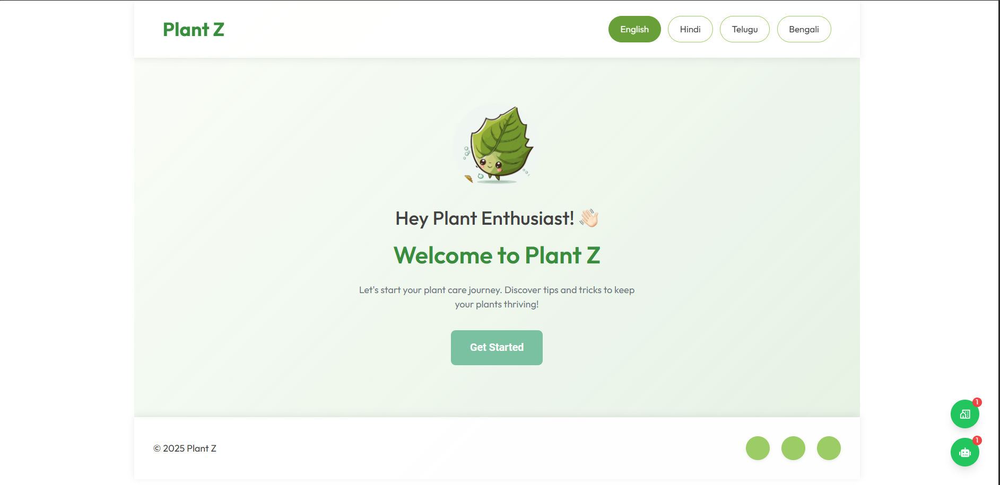
  <br><br>
  <a href="https://youtu.be/NiXpc6xm7Yo?si=Z1QWy18o-_eTSpnh" target="_blank">
    
  </a>
</div>

---

## Screenshots

<table>
  <tr>
    <td valign="top" width="50%">
      <h3 align="center">Home Dashboard</h3>
      
      <p align="center"><em>Multilingual dashboard designed for accessible plant care.</em></p>
    </td>
    <td valign="top" width="50%">
      <h3 align="center">Authentication</h3>
      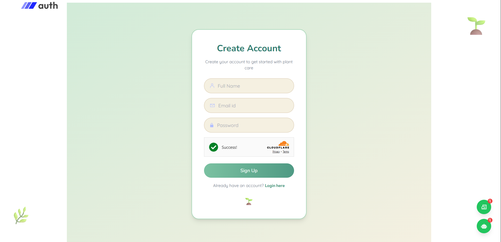
      <p align="center"><em>Secure sign-in and verification with Cloudflare Turnstile.</em></p>
    </td>
  </tr>
  <tr>
    <td valign="top" width="50%">
      <h3 align="center">My Plants Dashboard</h3>
      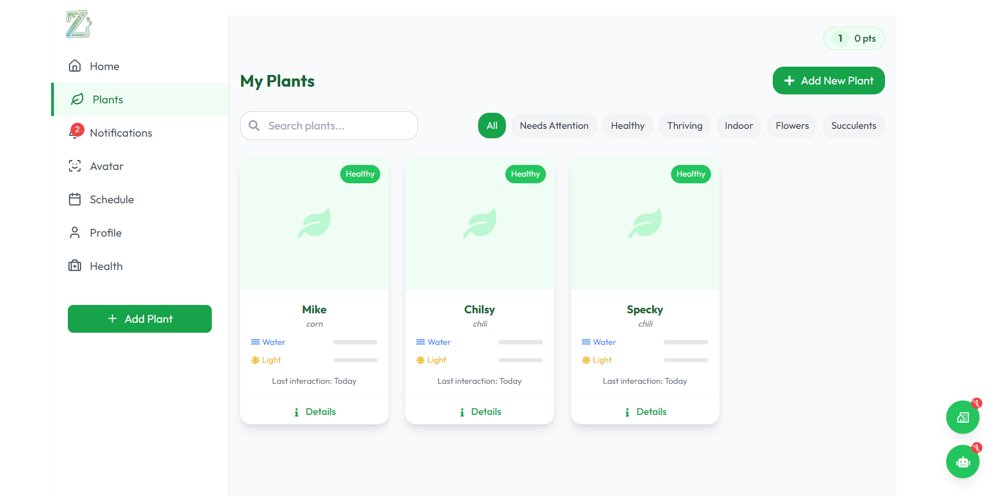
      <p align="center"><em>Track all plants, routines, and progress in one place.</em></p>
    </td>
    <td valign="top" width="50%">
      <h3 align="center">AI Chat Assistant</h3>
      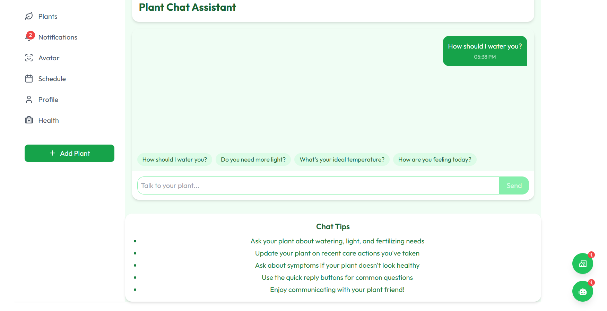
      <p align="center"><em>Conversational plant guidance powered by Gemini API.</em></p>
    </td>
  </tr>
  <tr>
    <td valign="top" width="50%">
      <h3 align="center">Plant Avatar System</h3>
      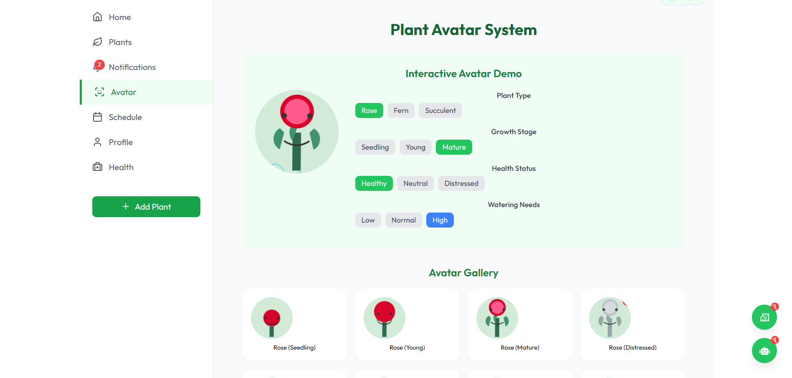
      <p align="center"><em>Emotional avatars represent real-time plant health.</em></p>
    </td>
    <td valign="top" width="50%">
      <h3 align="center">Avatar Gallery</h3>
      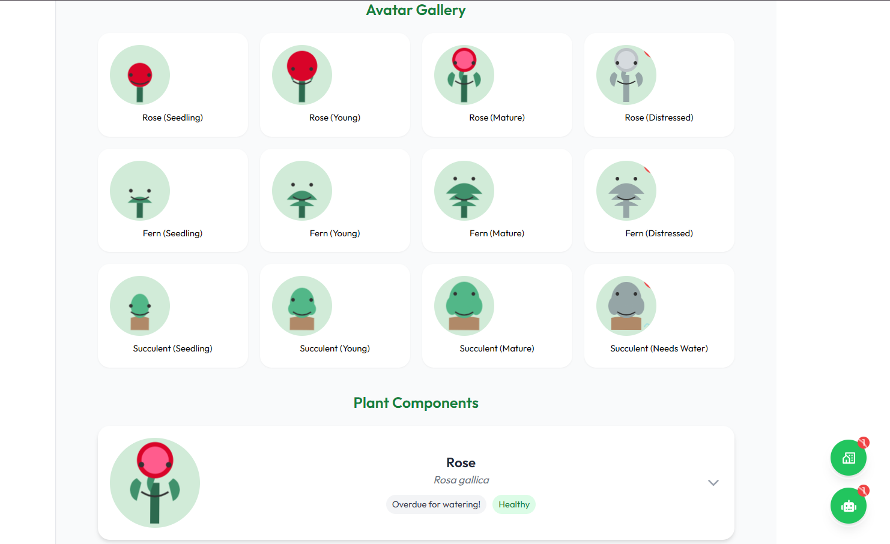
      <p align="center"><em>Discover playful and meaningful plant personalities.</em></p>
    </td>
  </tr>
  <tr>
    <td valign="top" width="50%">
      <h3 align="center">Avatar Animations</h3>
      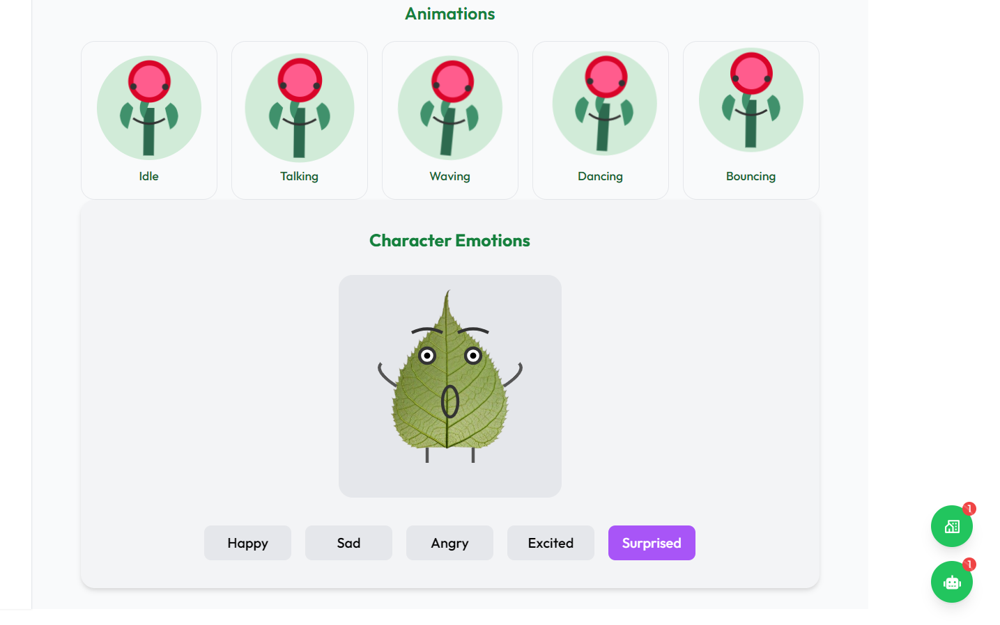
      <p align="center"><em>Rich animations improve engagement and retention.</em></p>
    </td>
    <td valign="top" width="50%">
      <h3 align="center">Plant Health Monitor</h3>
      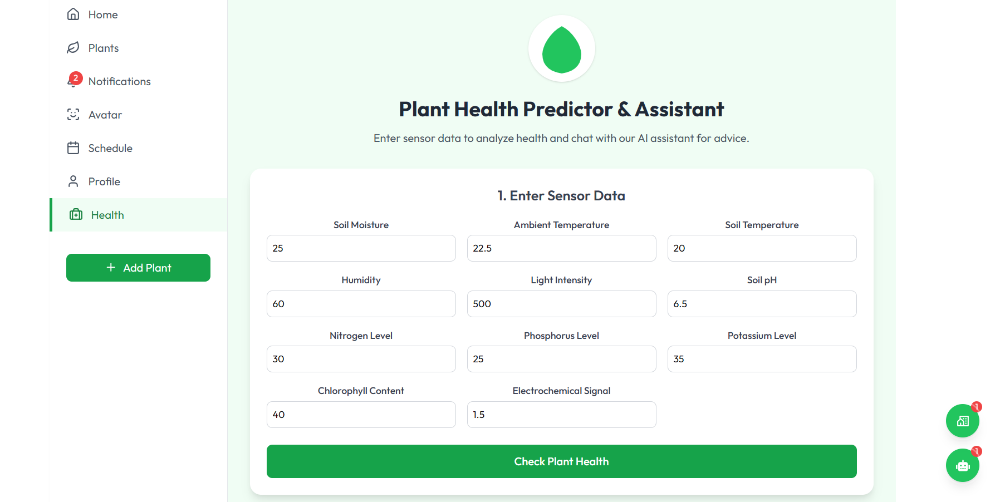
      <p align="center"><em>Health trends, alerts, and actionable diagnostics.</em></p>
    </td>
  </tr>
  <tr>
    <td valign="top" width="50%">
      <h3 align="center">Community Hub</h3>
      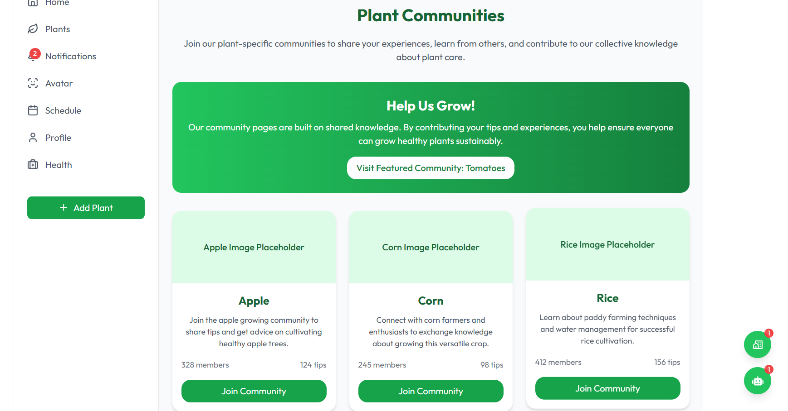
      <p align="center"><em>Knowledge sharing, discussion, and community support.</em></p>
    </td>
    <td valign="top" width="50%">
      <h3 align="center">Notifications Center</h3>
      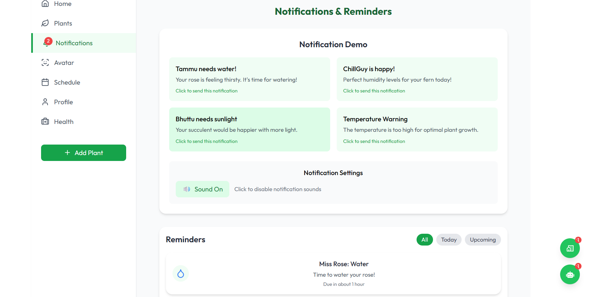
      <p align="center"><em>Smart reminders for watering, treatment, and upkeep.</em></p>
    </td>
  </tr>
  <tr>
    <td valign="top" width="50%">
      <h3 align="center">User Profile</h3>
      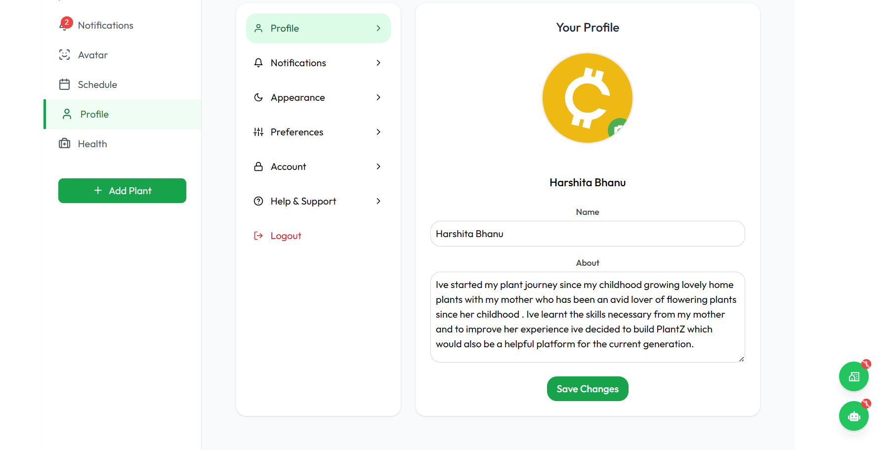
      <p align="center"><em>Personalized progress, settings, and activity history.</em></p>
    </td>
    <td valign="top" width="50%">
      <h3 align="center">Settings</h3>
      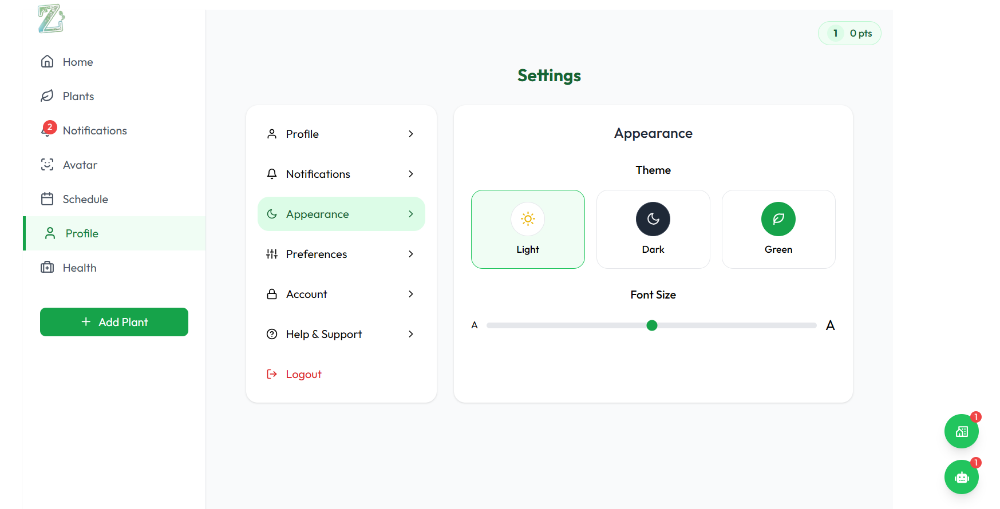
      <p align="center"><em>Fine-grained preferences for a tailored experience.</em></p>
    </td>
  </tr>
</table>

---

## Why PlantZ

PlantZ makes plant care practical, intelligent, and accessible. It combines conversational AI, computer vision, multilingual UX, and community features to support beginners and experienced growers alike.

---

## Core Features

### AI-Powered Plant Assistant
- Gemini API integration for natural, contextual conversations
- Instant responses to plant care questions
- Conversation memory for personalized assistance
- Multilingual support for broader accessibility

### Interactive Plant Management
- Avatar-based plant status visualization
- Unified dashboard for monitoring all plants
- Reminder-driven care scheduling
- Progress and wellness tracking over time

### Disease Detection and Diagnosis
- CNN-powered image analysis with high accuracy
- Fast symptom-based diagnosis workflow
- Actionable treatment recommendations
- Preventive care guidance

### Voucher-Sponsor Ecosystem
- Resource support for users through sponsor partnerships
- Community-oriented model for affordability and reach
- Sustainable value loop for users, mentors, and sponsors

---

## Tech Stack

### Frontend
- React 18+
- Tailwind CSS
- Framer Motion
- Cloudinary

### Backend
- Node.js 18+
- Express.js
- MongoDB 6+
- JWT Authentication
- Cloudflare Turnstile

### AI and ML
- Google Gemini API
- TensorFlow
- Scikit-learn
- OpenCV

---

## Performance Metrics

| Component | Accuracy | Precision | Recall | F1-Score |
|-----------|----------|-----------|--------|----------|
| Disease Detection | 98% | 98% | 98% | 98% |
| Plant Identification | 95% | 94% | 96% | 95% |

Dataset size: 70,029 training images and 17,572 testing images.

---

## Architecture

```text
React Client <-> Express API <-> MongoDB
      |              |
      |              +-> Gemini API (Assistant)
      +-> TensorFlow CNN (Disease Detection)
```

---

## Quick Start

### Prerequisites
- Node.js 18+
- MongoDB 6+
- npm or yarn

### Installation

```bash
git clone https://github.com/Divanshu0212/HackByte_3.0.git
cd HackByte_3.0

# root dependencies
npm install

# frontend dependencies
cd frontend
npm install
cd ..

# backend dependencies
cd backend
npm install
cd ..
```

### Environment Setup

Create `.env` files in both frontend and backend directories.

Backend `.env`:

```env
PORT=5000
MONGODB_URI=your_mongodb_connection_string
JWT_SECRET=your_jwt_secret
GEMINI_API_KEY=your_gemini_api_key
CLOUDINARY_CLOUD_NAME=your_cloudinary_name
CLOUDINARY_API_KEY=your_cloudinary_key
CLOUDINARY_API_SECRET=your_cloudinary_secret
```

Frontend `.env`:

```env
REACT_APP_API_URL=http://localhost:5000
REACT_APP_TURNSTILE_SITE_KEY=your_turnstile_site_key
```

### Run

```bash
# Run full project in dev mode
npm run dev

# Or run separately
cd backend
npm start

cd ../frontend
npm start
```

Open http://localhost:3000 in your browser.

---

## API Highlights

Authentication:

```text
POST /api/auth/register
POST /api/auth/login
POST /api/auth/verify
```

Plant Management:

```text
GET    /api/plants
POST   /api/plants
PUT    /api/plants/:id
DELETE /api/plants/:id
```

AI Assistant:

```text
POST /api/chat/message
GET  /api/chat/history
```

Disease Detection:

```text
POST /api/diagnosis/analyze
GET  /api/diagnosis/history
```

---

## Team

| Name | Role |
|------|------|
| Aryan Kesarwani | Backend Developer |
| Salugu Harshita Bhanu | Frontend and Security |
| Prakriti Das | AI and ML Specialist |
| Divanshu Bhargava | AI and ML Specialist |

---

## Acknowledgments

- [Google Gemini AI](https://ai.google.dev/) for conversational intelligence
- [TensorFlow](https://tensorflow.org/) for machine learning foundations
- [Plant Disease Dataset](https://www.kaggle.com/datasets/vipoooool/new-plant-diseases-dataset) contributors
- Open-source contributors whose tools power this platform

---

## Support

- Issues: [GitHub Issues](https://github.com/Git-brintsi20/HackByte_3.0/issues)
- Email: shiki2hustle@gmail.com

---

<div align="center">
  <strong>If PlantZ inspired you, a star on GitHub helps us grow.</strong>
  <br>
  Built with care by Team PlantZ.
</div>

